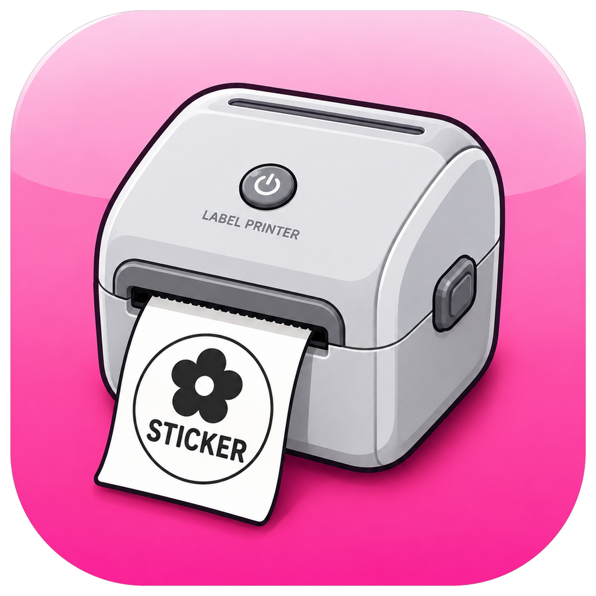

<p align="center">
  
</p>

<h1 align="center">Sticker</h1>

<p align="center">
  Print <b>round and rectangular stickers</b> on cheap Bluetooth thermal label printers — from your Mac.<br>
  Drop an image, fit it inside the shape, hit print. No vendor app, no phone.
</p>

---

## Why

Cheap thermal label printers (Phomemo M110/M120 and the many unbranded clones that
advertise themselves as **"Label Printer"**) ship with a phone app that is painful for
anything but plain text. If you bought a roll of **round die-cut labels** and want to put
your own artwork on them, you are on your own.

This is a small native macOS app that does exactly that, and nothing else.

## What it does

- **Round or rectangular labels** — pick the shape, set width, height and corner radius
- **Drop an image** into the window, onto the Dock icon, or open it with `File → Open`
- A **shaped mask** shows what lands on the label; everything in the pink area is cut off
- **Drag to move, slider to zoom** until the artwork sits where you want it
- The preview is not your file — it is a **1-bit render of what the print head will actually burn**
- **Print size and feed length are separate**: shrink the artwork to 35 mm while still
  feeding a 50 mm label, so the print stays inside the die-cut circle
- **Alignment pad**, ±0.5 mm per tap, for when the print creeps off the die-cut
- **Orientation**: mirror / 180° / both — thermal heads differ, one tap fixes it
- **Artwork vs Photo**: hard threshold for monograms and logos, Floyd–Steinberg dithering
  for photographs, plus a background cleaner that kills JPEG speckle on "white" areas
- **Copies**, print quality (head speed) and burn density
- Pin your printer so the app always connects to *yours*, or filter by name

## Install

Grab `Sticker.dmg` from [Releases](../../releases), drag **Sticker** into Applications.

The app is not notarized (it is free and unsigned), so the first launch needs:

**right-click the icon → Open → Open**

If macOS insists the app is damaged:

```bash
xattr -dr com.apple.quarantine /Applications/Sticker.app
```

Then allow Bluetooth when asked, and turn the printer on. Requires macOS 13 or newer.
Universal binary: Apple Silicon and Intel.

## Supported printers

Anything speaking the Phomemo M110 dialect over BLE — service `FF00`, write
characteristic `FF02`. Confirmed working:

| Printer | Advertised name |
|---|---|
| Phomemo M110 / M120 / M220 | `M110-xxxx`, `Phomemo…` |
| Unbranded clones | `Label Printer`, or the bare serial number, e.g. `Q199E4BU0980023` |

The print head is **384 dots wide (48 mm) at 203 dpi**. A 50 mm round label is therefore
printed 48 mm wide — the outermost millimetre on each side is unreachable by design.

## The protocol

Useful if you are writing your own driver. Commands must be sent as **separate GATT
writes with pauses** — merged into one stream the printer blinks and silently drops the job.

```
1b 4e 0d <speed>            speed, 1 = slow … 5 = fast     ⏸ 30 ms
1b 4e 04 <density>          burn density, 1 … 15           ⏸ 30 ms
1f 11 <media>               0a = gapped labels, 0b = continuous, 26 = black mark
1d 76 30 00 <w LE16> <h LE16>   raster header, w = 48 bytes per line
<bitmap>                    1 bpp, MSB = leftmost pixel, 1 = black, in 128-byte chunks ⏸ 20 ms
                                                           ⏸ 300 ms
1f f0 05 00 1f f0 03 00     footer                         ⏸ 500 ms
```

The app writes its Bluetooth trace to `~/Library/Logs/Sticker.log` — every device seen,
every service and characteristic found. Start there if it will not connect.

## Build from source

No Xcode project, no dependencies — just the Swift toolchain:

```bash
./build.sh          # produces dist/Sticker.app and dist/Sticker.dmg
```

Pass your own square PNG to replace the icon: `./build.sh my-icon.png`

## Credits

Protocol details were reverse-engineered by
[pyphomemo](https://github.com/mkuhlmann/pyphomemo) and
[phomemo-tools](https://github.com/vivier/phomemo-tools) — this app reimplements the same
byte sequences natively in Swift over CoreBluetooth.

## License

MIT

---

<details>
<summary><b>По-русски</b></summary>

Приложение для macOS: печать **круглых и прямоугольных наклеек** на дешёвых Bluetooth-принтерах этикеток
(Phomemo M110 и безымянные клоны, которые представляются как `Label Printer`).

Перетаскиваешь картинку → она ложится в круг, всё розовое обрежется → двигаешь мышкой,
крутишь масштаб → количество копий → **ПЕЧАТЬ**.

Что важно знать:

- **«Диаметр рисунка»** и **«Шаг наклейки»** — разные вещи. Первое — насколько крупно
  печатать, второе — сколько ленты протянуть. Рисунок должен помещаться внутрь белого
  пунктира, иначе краска попадёт на подложку.
- **«Выравнивание»** — если печать съезжает с вырубленного круга, двигай стрелками по
  полмиллиметра.
- **«Ориентация на ленте»** — если вышло зеркально или вверх ногами.
- **«Рисунок» вместо «Фото»** — для вензелей и логотипов. В режиме «Фото» полутона
  передаются точками, и «белый» фон из JPEG печатается крапинками. «Чистка фона» добивает
  почти-белое до чистого белого.
- Печатное поле головки — **48 мм**, поэтому у наклейки 50 мм по миллиметру с каждого
  бока недоступно физически.

Установка: скачать `Sticker.dmg` из [Releases](../../releases), перетащить в «Программы»,
**первый запуск — правый клик → «Открыть»**. Разрешить Bluetooth, включить принтер.

Если не подключается — смотри `~/Library/Logs/Sticker.log`, там видно каждое устройство
в эфире и все найденные каналы.

</details>
