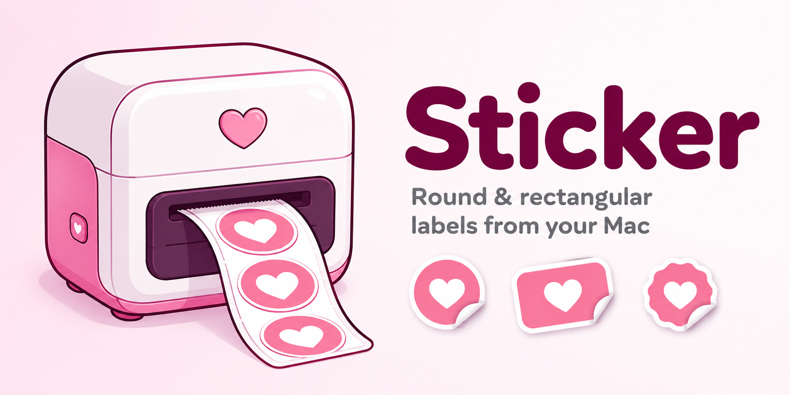
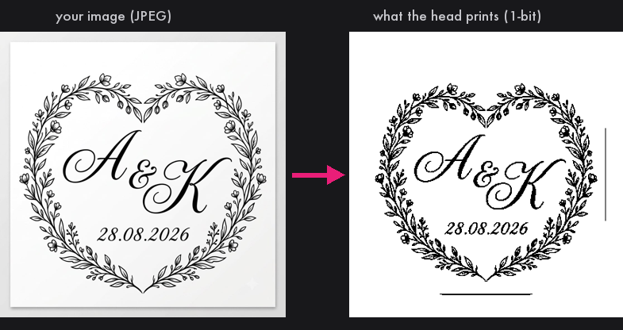

<p align="center">
  
</p>

<p align="center"><b>Print round and rectangular stickers on Phomemo M110, M120, M200, M220 and the countless no-name Bluetooth thermal label printers — right from your Mac.</b><br>
Drop an image, fit it inside the shape, hit Print. No vendor app, no phone, no account.</p>

<p align="center">
  <a href="https://github.com/MozgAI/sticker-mac/releases/latest/download/Sticker.dmg"></a>
</p>

<p align="center">
  <a href="../../releases/latest"></a>
  <a href="../../releases"></a>
  
  
  <a href="LICENSE"></a>
</p>

<p align="center">
  
</p>

Works with the **Phomemo M110**, **Phomemo M120**, **Phomemo M200/M220**, and the countless
white-label 58 mm thermal label makers sold on AliExpress, Amazon and Temu under names like
**Munbyn, POLONO, Marklife, Jadens, iDPRT** — many of them are the same board inside and show up
in Bluetooth as **“Label Printer”** or a bare serial number. If your sticker printer prints
48 mm wide at 203 dpi over Bluetooth LE, it almost certainly speaks the Phomemo M110 protocol
this app implements.

## Features

- **Round or rectangular labels** — width, height and corner radius in millimetres
- **Drop an image** into the window, onto the Dock icon, or “Open With → Sticker”
- The preview is not your file — it is the **exact 1-bit raster the print head will burn**
- **Artwork size and feed length are independent** — print a 35 mm design on a 50 mm die-cut
  label and stay inside the cut
- **Alignment pad** (±0.5 mm per tap) for when the print drifts off the die-cut
- **Mirror / 180° / both** — thermal heads differ; one tap fixes mirrored or upside-down output
- **Artwork mode** (clean threshold) for logos and monograms, **Photo mode** (Floyd–Steinberg
  dithering) for photographs, plus a **background cleaner** that kills JPEG speckle
- Copies, print speed, burn density
- **Pin your printer** or filter by name — never connect to the neighbour's device
- **English, Ukrainian and Russian** interface — switch with the flag buttons, no restart

## Install

1. Download **[Sticker.dmg](../../releases/latest/download/Sticker.dmg)** (≈3 MB, universal)
2. Drag **Sticker** into Applications
3. First launch: macOS blocks unsigned apps. Open **System Settings → Privacy & Security**,
   scroll down, click **“Open Anyway”** — or run:
   ```bash
   xattr -dr com.apple.quarantine /Applications/Sticker.app
   ```
4. Allow Bluetooth, switch the printer on. Done.

The app is free, open source, and does not touch the network — the only radio it uses is
Bluetooth to your printer.

## FAQ

**My prints come out mirrored / upside down.**
That is the print head, not your file. Switch **Orientation on tape** to *Mirror*, *180°* or
*Both* until it matches the preview. The preview itself never flips — it always shows the label
as it lands in your hand.

**White areas print with random dots and speckles.**
Your “white” JPEG background is actually 240–254 grey, and Photo mode faithfully dithers it.
Switch to **Artwork** mode and raise **Background cleanup** — the speckle disappears.

**The app can't find my printer, but the phone app sees it.**
Many clones don't advertise any brand — they appear as `Label Printer` or a serial number like
`Q199E4BU0980023`. Sticker recognises those, and every nearby device is listed under
**Printer** — just click yours once, then hit **Remember this printer**.

**The print misses the die-cut circle.**
Print a **Test outline** first, then nudge with the alignment pad in 0.5 mm steps. The offset
is remembered.

**Why is a 50 mm label printed only 48 mm wide?**
The head has 384 dots at 203 dpi = 48 mm. The outer millimetre on each side is physically
unreachable on every printer of this class.

**Does it work with Niimbot, Brother or DYMO label printers?**
No — Niimbot B1/B21/D110, Brother P-touch and DYMO use their own protocols. This app covers the
Phomemo M110 dialect, which the cheap 58 mm "Label Printer" clones share.

**Is my data uploaded anywhere?**
No. There is no network code in the app at all — check `Sources/`, it's ~1200 lines of Swift.

## Supported printers

| Printer | Advertised BLE name | Status |
|---|---|---|
| Phomemo M110 | `M110-xxxx`, `Phomemo…` | protocol reference |
| Phomemo M120 / M200 / M220 / M221 | `M120…`, `M220…` | same protocol family |
| Unbranded 58 mm label makers (Munbyn, POLONO, Marklife, Jadens, iDPRT rebrands) | `Label Printer`, bare serial (`Q199E4…`) | **confirmed working** |
| Anything with BLE service `FF00`, write characteristic `FF02` | — | should work |
| Niimbot B1 / B21 / D110, Brother, DYMO | — | ✗ different protocol, not supported |

## The protocol (for driver writers)

Reverse-engineered ESC/POS-like dialect. Commands **must be separate GATT writes with pauses** —
merged into one stream the printer blinks and silently drops the job.

```
1b 4e 0d <speed>                 1 = slow … 5 = fast          ⏸ 30 ms
1b 4e 04 <density>               1 … 15                       ⏸ 30 ms
1f 11 <media>                    0a gapped · 0b continuous · 26 black-mark
1d 76 30 00 <wLE16> <hLE16>      raster header, w = 48 bytes/line
<bitmap>                         1 bpp, MSB left, 1 = black, 128-byte chunks ⏸ 20 ms
                                                              ⏸ 300 ms
1f f0 05 00 1f f0 03 00          footer                       ⏸ 500 ms
```

The app logs every BLE device, service and characteristic it sees to
`~/Library/Logs/Sticker.log` — start there if anything misbehaves.

## Build from source

No Xcode project, no dependencies — just the Swift toolchain:

```bash
./build.sh        # → dist/Sticker.app + basic dmg
./make-dmg.sh     # → styled installer with background and layout
```

## Credits

Protocol byte sequences were first documented by
[phomemo-tools](https://github.com/vivier/phomemo-tools) and
[pyphomemo](https://github.com/mkuhlmann/pyphomemo). Sticker reimplements them natively in
Swift over CoreBluetooth.

## License

MIT — do whatever you like, attribution appreciated.
